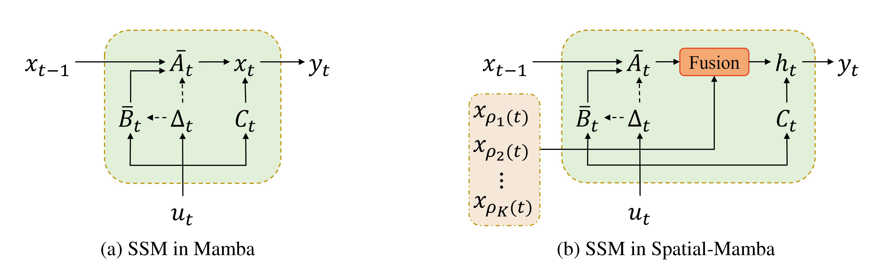

<div align="center">

<h1>Spatial-Mamba: Effective Visual State Space Models via Structure-Aware State Fusion</h1>

<div>
    <a href='https://github.com/EdwardChasel' target='_blank'>Chaodong Xiao<sup>1,2,*</sup></a>,
    <a href='https://scholar.google.com/citations?user=LhdBgMAAAAAJ' target='_blank'>Minghan Li<sup>1,3,*</sup></a>,
    <a href='https://scholar.google.com.hk/citations?hl=zh-CN&user=UX26wSMAAAAJ' target='_blank'>Zhengqiang Zhang<sup>1,2</sup></a>,
    <a href='https://gr.xjtu.edu.cn/en/web/dymeng/1' target='_blank'>Deyu Meng<sup>4</sup></a>,
    <a href='https://www4.comp.polyu.edu.hk/~cslzhang/' target='_blank'>Lei Zhang<sup>1,2,† </sup></a>
</div>
<div>
    <sup>1</sup>The Hong Kong Polytechnic University, <sup>2</sup>OPPO Research Institute,<br><sup>3</sup>Harvard Medical School, <sup>4</sup>Xi'an Jiaotong University
</div>
<div>
	(*) equal contribution, (†) corresponding author
</div>

[[📝 arXiv paper]](https://arxiv.org/abs/2410.15091)

---

</div>

## Abstaract

Selective state space models (SSMs), such as Mamba, highly excel at capturing long-range dependencies in 1D sequential data, while their applications to 2D vision tasks still face challenges. Current visual SSMs often convert images into 1D sequences and employ various scanning patterns to incorporate local spatial dependencies. However, these methods are limited in effectively capturing the complex image spatial structures and the increased computational cost caused by the lengthened scanning paths. To address these limitations, we propose Spatial-Mamba, a novel approach that establishes neighborhood connectivity directly in the state space. Instead of relying solely on sequential state transitions, we introduce a structure-aware state fusion equation, which leverages dilated convolutions to capture image spatial structural dependencies, significantly enhancing the flow of visual contextual information. Spatial-Mamba proceeds in three stages: initial state computation in a unidirectional scan, spatial context acquisition through structure-aware state fusion, and final state computation using the observation equation. Our theoretical analysis shows that Spatial-Mamba unifies the original Mamba and linear attention under the same matrix multiplication framework, providing a deeper understanding of our method. Experimental results demonstrate that Spatial-Mamba, even with a single scan, attains or surpasses the state-of-the-art SSM-based models in image classification, detection and segmentation.

## 🎬 Overview

<p align="center">
  
</p>

<p align="center">
  
</p>

## 🎯 Main Results

* ### Image Classification on ImageNet-1K

<p align="center">
  
</p>

* ### Object Detection and Instance Segmentation on COCO

<p align="center">
  
</p>

* ### Semantic Segmentation on ADE20K

<p align="center">
  
</p>

## 🛠️ Getting Started

1. Clone repo
   
   ```bash
   git clone https://github.com/EdwardChasel/Spatial-Mamba.git
   cd Spatial-Mamba
   ```
2. Create and activate a new conda environment
   
   ```bash
   conda create -n Spatial-Mamba python=3.10
   conda activate Spatial-Mamba
   ```
3. Install dependent packages
   
   ```bash
   pip install --upgrade pip
   pip install -r requirements.txt
   cd kernels/selective_scan && pip install .
   cd kernels/dwconv2d && python3 setup.py install --user
   ```
4. Dependencies for detection and segmentation (optional)
   
   ```bash
   pip install mmengine==0.10.1 mmcv==2.1.0 opencv-python-headless ftfy regex
   pip install mmdet==3.3.0 mmsegmentation==1.2.2 mmpretrain==1.2.0
   ```

## ✨ Pre-trained Models

<details>
<summary> ImageNet-1k Image Classification </summary>
<br>

<div>

|      name      |   pretrain   | resolution | acc@1 | #param | FLOPs |                                                                             download                                                                              |
| :------------: | :----------: | :--------: | :---: | :----: | :---: | :---------------------------------------------------------------------------------------------------------------------------------------------------------------: |
| Spatial-Mamba-T  | ImageNet-1K  |  224x224   | 83.5  |  27M   |  4.5G   |       [ckpt](https://drive.google.com/file/d/19kXoqGSTuKKs4AHbdUSrdKZTwTWenLIW/view?usp=drive_link) \| [config](classification/configs/spatialmamba/spatialmamba_tiny.yaml)       |
| Spatial-Mamba-S  | ImageNet-1K  |  224x224   | 84.6  |  43M   |  7.1G   |       [ckpt](https://drive.google.com/file/d/1Wb3sYoWLpgmWrmHMYKwdgDwGPZaqM28O/view?usp=drive_link) \| [config](classification/configs/spatialmamba/spatialmamba_small.yaml)       |
| Spatial-Mamba-B  | ImageNet-1K  |  224x224   | 85.3  |  96M   |  15.8G  |       [ckpt](https://drive.google.com/file/d/1k8dHp2QRCOqBSgAi36YkhZp_O8LqOPjM/view?usp=drive_link) \| [config](classification/configs/spatialmamba/spatialmamba_base.yaml)       |

</div>

</details>

<details>
<summary> COCO Object Detection and Instance Segmentation </summary>
<br>
<div>

|    backbone    |   method   | schedule  | mAP (box/mask)  | #param | FLOPs |                                                                                     download                                                                                      |
| :------------: | :--------: | :---: | :-----: | :----: | :---: | :-------------------------------------------------------------------------------------------------------------------------------------------------------------------------------: |
| Spatial-Mamba-T  | Mask R-CNN |  1x   |  47.6   /   42.9   |  46M   | 261G  | [ckpt](https://drive.google.com/file/d/1lmA0_pBQbvuMkJD1R5m3oS_2jXaSy3N3/view?usp=drive_link) \| [config](detection/configs/spatialmamba/mask_rcnn_spatialmamba_fpn_coco_tiny.py) |
| Spatial-Mamba-S  | Mask R-CNN |  1x   |  49.2   /   44.0   |  63M   | 315G  | [ckpt](https://drive.google.com/file/d/1pzjz1A6nWA9W2FW2Ymg5JSAMbvxmc2hP/view?usp=drive_link) \| [config](detection/configs/spatialmamba/mask_rcnn_spatialmamba_fpn_coco_small.py) |
| Spatial-Mamba-B  | Mask R-CNN |  1x   |  50.4   /   45.1   |  115M   | 494G  | [ckpt](https://drive.google.com/file/d/1oTyT0q88ernqc1_IyqBWHrVJJPGNRN8r/view?usp=drive_link) \| [config](detection/configs/spatialmamba/mask_rcnn_spatialmamba_fpn_coco_base.py) |
| Spatial-Mamba-T  | Mask R-CNN |  3x   |  49.3   /   43.6   |  46M   | 261G  | [ckpt](https://drive.google.com/file/d/1PY0_8ZCwogssmaULdc6MzVbCTGm_83Ew/view?usp=drive_link) \| [config](detection/configs/spatialmamba/mask_rcnn_spatialmamba_fpn_coco_tiny_3x.py) |
| Spatial-Mamba-S  | Mask R-CNN |  3x   |  50.5   /   44.6   |  63M   | 315G  | [ckpt](https://drive.google.com/file/d/19fDAk8cyMplgVRKqU0BC_3l1NxXzHYl_/view?usp=drive_link) \| [config](detection/configs/spatialmamba/mask_rcnn_spatialmamba_fpn_coco_small_3x.py) |

</div>

</details>

<details>
<summary> ADE20K Semantic Segmentation </summary>
<br>
<div>

|    backbone    |   method    | resolution | mIoU (ss/ms) | #param | FLOPs |                                                                                           download                                                                                           |
| :------------: | :---------: | :--------: | :----------: | :----: | :---: | :------------------------------------------------------------------------------------------------------------------------------------------------------------------------------------------: |
| Spatial-Mamba-T  |   UPerNet   |  512x512   | 48.6 / 49.4  |  57M   | 936G  |  [ckpt](https://drive.google.com/file/d/1ngRweMh6vLjfZ43fb_o_ZyHs6psxb6Ix/view?usp=drive_link) \| [config](segmentation/configs/spatialmamba/upernet_spatialmamba_4xb4-160k_ade20k-512x512_tiny.py)  |
| Spatial-Mamba-S  |   UPerNet   |  512x512   | 50.6 / 51.4  |  73M   | 992G |  [ckpt](https://drive.google.com/file/d/1Ve07Um4dIPCcdg0mdNLjGxJtxKNWB_Sy/view?usp=drive_link) \| [config](segmentation/configs/spatialmamba/upernet_spatialmamba_4xb4-160k_ade20k-512x512_small.py)  |
| Spatial-Mamba-B  |   UPerNet   |  512x512   | 51.8 / 52.6  |  127M   | 1176G |  [ckpt](https://drive.google.com/file/d/1DLSC20TiSfzWrdgLRSdgrhnDn79nruB6/view?usp=drive_link) \| [config](segmentation/configs/spatialmamba/upernet_spatialmamba_4xb4-160k_ade20k-512x512_base.py)  |

</div>
</details>

## 📚 Data Preparation

* ImageNet is an image database organized according to the WordNet hierarchy. Download and extract ImageNet train and val images from http://image-net.org/. Organize the data into the following directory structure:
  
  ```
  imagenet/
  ├── train/
  │   ├── n01440764/  (Example synset ID)
  │   │   ├── image1.JPEG
  │   │   ├── image2.JPEG
  │   │   └── ...
  │   ├── n01443537/  (Another synset ID)
  │   │   └── ...
  │   └── ...
  └── val/
      ├── n01440764/  (Example synset ID)
      │   ├── image1.JPEG
      │   └── ...
      └── ...
  ```
* COCO is a large-scale object detection, segmentation, and captioning dataset. Please visit http://cocodataset.org/ for more information, including for the data, paper, and tutorials. [COCO API](https://github.com/cocodataset/cocoapi) also provides a concise and efficient way to process the data.
* ADE20K is composed of more than 27K images from the SUN and Places databases. Please visit https://ade20k.csail.mit.edu/ for more information and see the [GitHub Repository](https://github.com/CSAILVision/ADE20K) for an overview of how to access and explore ADE20K.

## 🚀 Quick Start

* **Image Classification**
  
  To train Spatial-Mamba models for classification on ImageNet, use the following commands for different configurations:
  
  ```bash
  cd classification 
  python -m torch.distributed.launch --nnodes=1 --node_rank=0 --nproc_per_node=8 --master_addr="127.0.0.1" --master_port=29501 main.py --cfg </path/to/config> --batch-size 128 --data-path </path/of/dataset> --output /tmp
  ```
  
  To evaluate the performance with pre-trained weights:
  
  ```bash
  cd classification 
  python -m torch.distributed.launch --nnodes=1 --node_rank=0 --nproc_per_node=1 --master_addr="127.0.0.1" --master_port=29501 main.py --cfg </path/to/config> --batch-size 128 --data-path </path/of/dataset> --output /tmp --pretrained </path/of/checkpoint>
  ```
* **Detection and Segmentation**
  
  To train with mmdetection or mmsegmentation:
  
  ```bash
  cd detection
  bash ./tools/dist_train.sh </path/to/detection/config> 8
  ```
  
  ```bash
  cd segmentation
  bash ./tools/dist_train.sh </path/to/segmentation/config> 8
  ```
  
  To evaluate with mmdetection or mmsegmentation:
  
  ```bash
  cd detection
  bash ./tools/dist_test.sh </path/to/detection/config> </path/to/detection/checkpoint> 1
  ```
  
  ```bash
  cd segmentation
  bash ./tools/dist_test.sh </path/to/segmentation/config> </path/to/segmentation/checkpoint> 1
  ```
  
  use `--tta` to get the `mIoU(ms)` in segmentation.

## 🖊️ Citation

```BibTeX
@article{xiao2024spatialmamba,
  title={Spatial-Mamba: Effective Visual State Space Models via Structure-Aware State Fusion},
  author={Chaodong Xiao and Minghan Li and Zhengqiang Zhang and Deyu Meng and Lei Zhang},
  journal={arXiv preprint arXiv:2410.15091},
  year={2024}
}
```

## 💌 Acknowledgments

This project is largely based on [Mamba](https://github.com/state-spaces/mamba), [VMamba](https://github.com/MzeroMiko/VMamba), [MLLA](https://github.com/LeapLabTHU/MLLA), [Swin-Transformer](https://github.com/microsoft/Swin-Transformer), [RepLKNet](https://arxiv.org/abs/2203.06717) and [OpenMMLab](https://github.com/open-mmlab). We are truly grateful for their excellent work.

## 🎫 License
This project is released under the [Apache 2.0 license](LICENSE).

